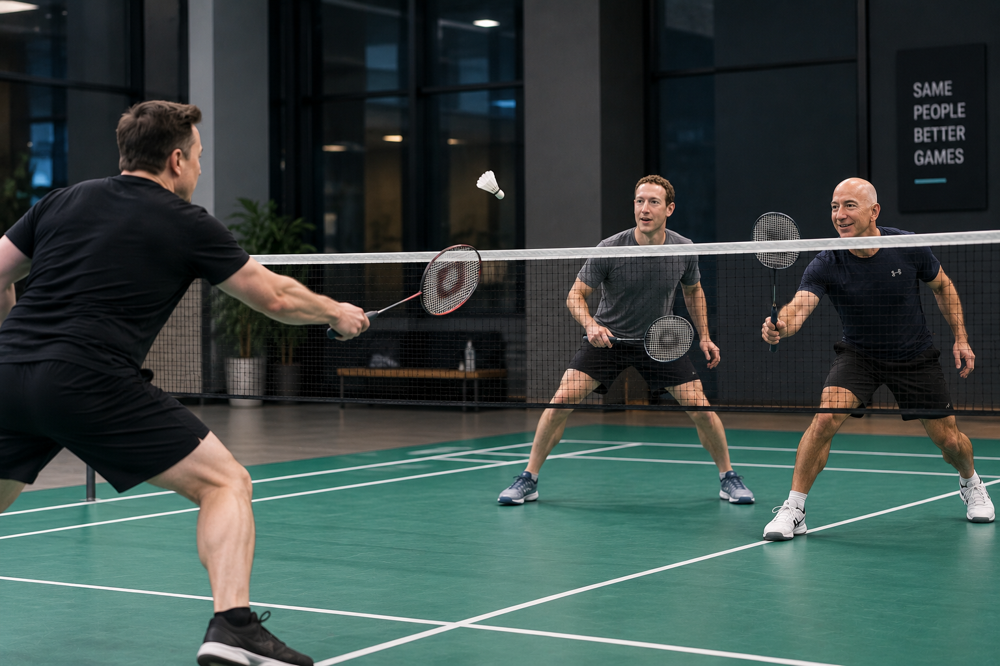
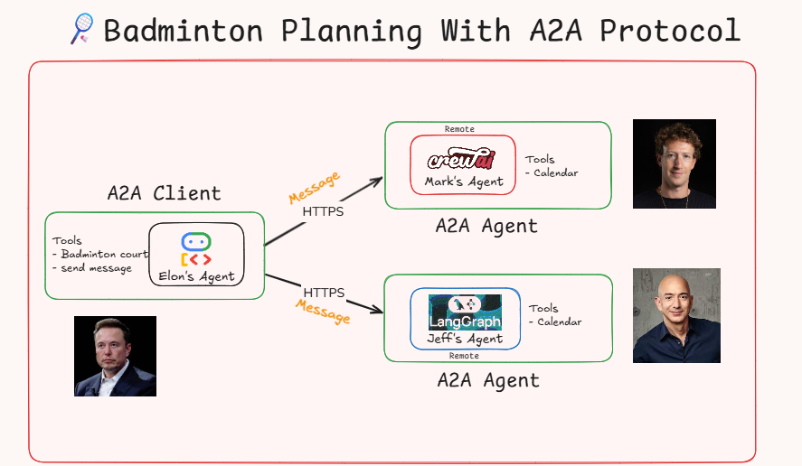

# A2A Badminton Scheduling Project

<div align="center">
  
</div>

A multi-agent system demonstrating Agent-to-Agent (A2A) communication using Google's A2A SDK. The project simulates a real-world scenario where multiple AI agents coordinate autonomously to schedule badminton games.

## 🎯 Project Goal

This project demonstrates **Agent-to-Agent (A2A) communication** where AI agents can:
- Communicate with each other autonomously across different server ports
- Coordinate complex scheduling tasks across multiple framework implementations
- Share information and make collaborative decisions dynamically
- Use custom tools to check calendar availability and book resources

### Real-World Scenario

**Elon Agent** (Host/Coordinator) wants to organize a badminton game. It needs to:
1. Ask **Jeff Agent** and **Mark Agent** about their availability for September 2026 dates
2. Find a common time slot when both are free (e.g., September 18, 2026)
3. Check court availability using court scheduling tools
4. Book a badminton court for the agreed time

This mimics how human assistants would coordinate — each agent manages its own schedule data and tools, and they communicate via the standard A2A protocol to reach a common goal.

---

## 🏗️ Architecture

<div align="center">
  
</div>

### Agent Overview

| Agent | Framework | Role | Port | Tools |
|-------|-----------|------|------|-------|
| **Elon Agent** | Google ADK + LiteLLM | Host/Coordinator - Orchestrates scheduling | 8000 (ADK Web UI) | `send_message`, `list_court_availabilities`, `book_badminton_court` |
| **Jeff Agent** | LangChain + LangGraph | Jeff's Scheduling Assistant | 10004 | `get_availability` (checks Jeff's calendar) |
| **Mark Agent** | CrewAI | Mark's Scheduling Assistant | 10005 | `AvailabilityTool` (checks Mark's calendar) |

### Technology Stack

- **A2A SDK**: Agent-to-Agent communication protocol (`a2a-sdk`)
- **Google ADK**: Agent Development Kit for building conversational host agents
- **LangChain / LangGraph**: Framework for building LLM agents with state graphs and memory
- **CrewAI**: Autonomous multi-agent framework
- **Groq / LiteLLM**: Ultra-fast LLM inference using models like `groq/openai/gpt-oss-120b`
- **UV**: Lightning-fast Python package manager

---

## 📋 Prerequisites

- Python 3.13+ (`.python-version` specifies Python 3.13.2)
- UV package manager ([Installation guide](https://docs.astral.sh/uv/))
- Groq API Key (for Groq-hosted LLMs)

---

## 🚀 Setup Instructions

### 1. Clone and Navigate to Project

```bash
git clone <repository-url>
cd A2A-Project
```

### 2. Configure Environment Variables

Create a `.env` file in the project root:

```bash
# .env
GROQ_API_KEY=your_groq_api_key_here
```

> **Get your Groq API Key**: Visit the [Groq Console](https://console.groq.com/) to generate an API key.

### 3. Install Dependencies

Each agent has its own `pyproject.toml`. Install dependencies per agent using `uv`:

```bash
cd elon_agent
uv sync

cd ../jeff_agent
uv sync

cd ../mark_agent
uv sync
```

---

## 🎮 Running the Agents

### Jeff Agent (Port 10004)

Jeff's scheduling assistant runs as an A2A server built with LangChain and LangGraph.

```bash
cd jeff_agent
uv run python __main__.py
```

**Expected Output:**
```
INFO:     Started server process [...]
INFO:     Waiting for application startup.
INFO:     Application startup complete.
INFO:     Uvicorn running on http://localhost:10004 (Press CTRL+C to quit)
```

**Test the agent card:**
```bash
curl http://localhost:10004/.well-known/agent-card.json
```

---

### Mark Agent (Port 10005)

Mark's scheduling assistant runs as an A2A server built with CrewAI.

```bash
cd mark_agent
uv run python __main__.py
```

**Expected Output:**
```
INFO:     Started server process [...]
INFO:     Waiting for application startup.
INFO:     Application startup complete.
INFO:     Uvicorn running on http://localhost:10005 (Press CTRL+C to quit)
```

**Test the agent card:**
```bash
curl http://localhost:10005/.well-known/agent-card.json
```

---

### Elon Agent (ADK Web UI)

The host coordinator agent runs via Google ADK web interface on port 8000.

```bash
cd elon_agent
uv run adk web
```

**Expected Output:**
```
ADK Web Server started
For local testing, access at http://127.0.0.1:8000
```

**Access the UI:**
Open your browser and navigate to:
```
http://127.0.0.1:8000
```

---

## 🧪 Testing the Complete System

### Step 1: Verify All Agents are Running

Check that all three agents are active and responding:

```bash
# Jeff Agent
curl http://localhost:10004/.well-known/agent-card.json

# Mark Agent
curl http://localhost:10005/.well-known/agent-card.json

# Elon Agent (ADK UI)
curl http://127.0.0.1:8000
```

### Step 2: Test via ADK Web UI

1. Open your browser to `http://127.0.0.1:8000`
2. Select `elon_agent` from the dropdown menu
3. Start a conversation to schedule a game (Note: sample calendar data is in September 2026)

**Example Queries:**

```
"Hi, can you help me organize a badminton game with Jeff and Mark?"

"Check if Jeff is available on September 18th, 2026"

"Ask Mark about his availability for September 18th, 2026"

"Find a common time when both Jeff and Mark are free in September 2026"

"Check court availability for 2026-09-18 at 10:00 AM"

"Book a court for us on 2026-09-18 from 10:00 to 11:00 for Elon's Game"
```

> 💡 **Pro Tip**: `2026-09-18` is configured as the ideal test date where Jeff, Mark, and Elon's court schedule are all fully available.

### Step 3: Observe Agent-to-Agent Communication

Watch the terminal logs across all three agent processes:
- **Elon Agent**: Resolves remote agent cards (`http://localhost:10004`, `http://localhost:10005`) and sends A2A message requests.
- **Jeff Agent**: Processes incoming A2A requests via LangChain agent executor and returns availability status.
- **Mark Agent**: Processes incoming A2A requests via CrewAI agent executor and queries its `AvailabilityTool`.
- **Elon Agent**: Aggregates responses, identifies slot overlaps, checks court slots, and executes court booking.

---

## 📁 Project Structure

```
A2A-Project/
├── .env                          # Environment variables (GROQ_API_KEY)
├── .python-version               # Python version (3.13.2)
├── README.md                     # Project documentation
├── architecture.png              # Multi-agent architecture visual diagram
├── goal.png                      # Project goal diagram
├── src/                          # Root package placeholder
│   └── a2a_project/
│       └── __init__.py
│
├── elon_agent/                   # Host coordinator agent (Google ADK)
│   ├── pyproject.toml             # Agent dependencies (a2a-sdk, google-adk, litellm)
│   ├── uv.lock                    # UV lockfile
│   └── elon/
│       ├── agent.py               # Main host agent with A2A client integration
│       └── tools.py               # Court schedule & booking tools
│
├── jeff_agent/                   # Jeff's scheduling agent (LangChain + LangGraph)
│   ├── __main__.py                # A2A server entry point (port 10004)
│   ├── agent.py                   # LangChain agent with state graph
│   ├── agent_executor.py          # A2A task executor wrapper
│   ├── pyproject.toml             # Agent dependencies (langchain, langgraph, a2a-sdk)
│   ├── tools.py                   # Calendar availability checking tool
│   └── uv.lock                    # UV lockfile
│
└── mark_agent/                   # Mark's scheduling agent (CrewAI)
    ├── __main__.py                # A2A server entry point (port 10005)
    ├── agent.py                   # CrewAI agent definition
    ├── agent_executor.py          # A2A task executor wrapper
    ├── pyproject.toml             # Agent dependencies (crewai, a2a-sdk)
    ├── tools.py                   # AvailabilityTool wrapper for CrewAI
    └── uv.lock                    # UV lockfile
```

---

## 🔧 How It Works

### 1. Agent Communication Flow

```
User → Elon Agent (ADK Web UI)
         ↓
    [Send Message via A2A Protocol]
         ↓
    ┌────┴────┐
    ↓         ↓
Jeff Agent  Mark Agent
 (10004)     (10005)
    ↓         ↓
[Check Calendar]
    ↓         ↓
[Return Availability]
    ↓         ↓
    └────┬────┘
         ↓
    Elon Agent
         ↓
[Find Common Time]
         ↓
[Check Court Availability]
         ↓
[Book Badminton Court]
         ↓
    User ← Confirmation
```

### 2. A2A Protocol

Each agent server exposes:
- **Agent Card** (`/.well-known/agent-card.json`): Machine-readable metadata listing skills, input/output modes, and agent capabilities.
- **Task & Request Handlers**: Manages asynchronous communication using standard A2A task handlers (`DefaultRequestHandler` and `AgentExecutor`).
- **Response Format**: Encapsulates results into standard A2A artifacts (`TextPart`, `Part`).

### 3. Tools & Capabilities

**Jeff Agent Tools:**
- `get_availability(date_str)`: Queries Jeff's calendar dictionary for available time ranges on a specific `YYYY-MM-DD` date.

**Mark Agent Tools:**
- `AvailabilityTool`: Custom CrewAI `BaseTool` that checks Mark's schedule and returns formatted calendar availability.

**Elon Agent Tools:**
- `send_message(agent_name, task)`: Wraps `A2AClient` to send `SendMessageRequest` payloads to target agents (Jeff or Mark).
- `list_court_availabilities(date)`: Queries court schedule database for open and booked court slots.
- `book_badminton_court(date, start_time, end_time, reservation_name)`: Reserves a badminton court slot.

---

## 🐛 Troubleshooting

### Common Issues

#### 1. Missing GROQ_API_KEY

**Error:** `ValueError: GROQ_API_KEY not found in environment` or model initialization failure.

**Solution:** Ensure `.env` exists in the root directory with a valid Groq API key:
```bash
GROQ_API_KEY=gsk_your_actual_key_here
```

#### 2. Import Error: `No module named 'a2a'` or missing package

**Solution:** Always execute python commands using `uv run` inside the specific agent directory:
```bash
cd jeff_agent
uv run python __main__.py
```

#### 3. Port Already in Use (10004, 10005, or 8000)

**Solution:** Terminate any running process occupying the ports:
- **Windows (PowerShell):**
  ```powershell
  Get-Process -Id (Get-NetTCPConnection -LocalPort 10004).OwningProcess | Stop-Process
  Get-Process -Id (Get-NetTCPConnection -LocalPort 10005).OwningProcess | Stop-Process
  Get-Process -Id (Get-NetTCPConnection -LocalPort 8000).OwningProcess | Stop-Process
  ```
- **Linux/macOS:**
  ```bash
  lsof -ti:10004 | xargs kill -9
  lsof -ti:10005 | xargs kill -9
  lsof -ti:8000 | xargs kill -9
  ```

#### 4. Python Version Mismatch

**Solution:** Ensure you are using Python 3.13+. Verify your environment with:
```bash
uv python pin 3.13
```

#### 5. No Availability Found / Invalid Dates

**Solution:** The default sample calendars contain data for **September 2026** (e.g., `2026-09-18`). Make sure to specify dates in the `2026-09-XX` range when testing queries.

---

## 📚 Key Concepts

### Agent-to-Agent (A2A) Communication

- **Decentralized Protocol**: Independent agent processes communicating over standard HTTP interfaces.
- **Interoperable**: Enables seamless communication regardless of underlying frameworks (LangChain, CrewAI, ADK).
- **Tool-Augmented**: Autonomous agents leverage local domain tools and remote agent queries to resolve end-to-end workflows.
- **Asynchronous Execution**: Supports non-blocking task delivery and background processing.

### Why Multiple Frameworks?

This project intentionally showcases a multi-framework architecture:
- **Google ADK**: Used for host coordination and web interaction.
- **LangChain / LangGraph**: Used for stateful calendar query workflows.
- **CrewAI**: Used for role-based task delegation and tool invocation.

---

## 🎓 Learning Resources

- [Google ADK Documentation](https://ai.google.dev/adk)
- [A2A SDK Documentation](https://github.com/google/a2a-sdk)
- [LangChain Documentation](https://python.langchain.com/)
- [CrewAI Documentation](https://docs.crewai.com/)
- [Groq Developer Documentation](https://console.groq.com/docs)
- [UV Package Manager](https://docs.astral.sh/uv/)

---

## 🤝 Contributing

Contributions, issues, and feature requests are welcome! Feel free to:
- Add new friend agents with different frameworks
- Expand calendar integration with Google Calendar or Outlook APIs
- Add automated integration tests for A2A endpoints
- Enhance prompt instructions and agent skills

---

## 📄 License

This project is open-source and intended for educational purposes.

---

## 🙏 Acknowledgments

- Google AI for ADK and the A2A communication protocol specification
- Groq for high-speed LLM inference capabilities
- LangChain and CrewAI communities for robust multi-agent frameworks

---

**Happy Agent Building! 🤖🏸**
